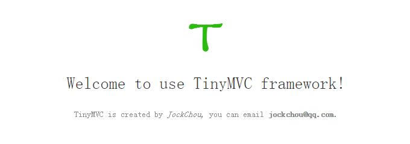

# TinyMVC
[](https://packagist.org/packages/jockchou/tinymvc)
[](https://packagist.org/packages/jockchou/tinymvc)
[](https://packagist.org/packages/jockchou/tinymvc)
[](https://packagist.org/packages/jockchou/tinymvc)

TinyMVC is a small PHP MVC framework

----------

# 一. 如何快速运行TinyMVC

下载或者git clone TinyMVC源码到本地，进入到public/index.php文件所在目录，`index.php`是框架入口文件，在`public`目录执行以下命令启动php内置服务器


> $ php -S localhost:8080  
> PHP 5.6.16 Development Server started at Fri Sep 23 14:58:22 2016  
> Listening on http://localhost:8080  
> Document root is D:\gitroot\TinyMVC\public  
> Press Ctrl-C to quit.  

此时服务器已经监听8080端口，根目录是`public`目录，在浏览器地址栏输入地址:http://localhost:8080，出现以下内容说明运行成功

# 二. 开发HelloWorld

#### 1. 导入数据库
将resource/tiny.sql导入你的MySQL数据库中

#### 2. 修改配置
将/config/dev/database.php配置修改成你的数据库信息

```
$config['default']['dsn'] = 'mysql:host=localhost;port=3306;dbname=tiny;charset=utf8mb4';
$config['default']['username'] = 'root';
$config['default']['password'] = '123456';
```

在浏览器地址栏输入地址:http://localhost:8080/index.php?c=hello&m=greeting观察输出页面。你可以这样访问helloworld程序http://localhost:8080/hello/greeting

#### 3. 目录结构

```
.
├── application                    ##业务逻辑实现，MVC
│   ├── controller                 ##控制器
│   │   └── DefaultController.php  ##默认控制器
│   ├── model                      ##模型
│   └── view                       ##视图
│       ├── 404.php
│       └── 500.php
├── config                         ##配置文件目录
│   ├── dev
│   └── prd
├── core                           ##框架核心文件
│   ├── Controller.php
│   ├── Model.php
│   └── Template.php
├── LICENSE
├── README.md
└── public                         ##网站根目录
    ├── css                        ##css文件目录
    ├── js                         ##js文件目录
    ├── images                     ##图片目录
	├── favicon.ico 
    └── index.php                  ##框架入口
```

# 三. 联系我 ##
你可以发邮件到：jockchou@qq.com