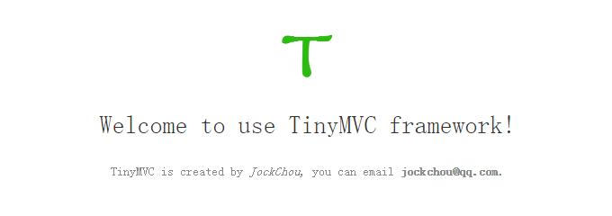

# TinyMVC

TinyMVC is a small PHP MVC framework

----------

## 1. 导入数据库 ##
将tiny.sql导入你的MySQL数据库中

## 2. 修改数据库配置 ##
将`/Config/dev/database.php`配置修改成你的数据库信息
```
$config['default']['dsn'] = 'mysql:host=localhost;port=3306;dbname=tiny;charset=utf8mb4';
$config['default']['username'] = 'root';
$config['default']['password'] = '123456';
```

## 3. 启动PHP内置服务器 ##
进入到`/Web/index.php`文件所在目录，`index.php`是框架入口文件，在`Web`目录执行以下命令启动php内置服务器
```
$ php -S localhost:8080
PHP 5.6.16 Development Server started at Tue Aug 30 13:53:56 2016
Listening on http://localhost:8080
```
此时服务器已经监听8080端口

## 4. 在浏览器中预览 ##
在浏览器地址栏输入地址:`http://localhost:8080`，出现以下内容说明运行成功


## 5. 开发 ##
在浏览器地址栏输入地址:`http://localhost:8080/index.php?c=hello&m=greeting`观察输出页面，并阅读`App`目录下的MVC三个文件夹中的代码

```
.
├── App
│   ├── Controller
│   │   ├── DefaultController.php
│   │   └── HelloController.php
│   ├── Model
│   │   └── UserModel.php
│   └── View
│       ├── 404.php
│       ├── Default
│       │   └── index.php
│       └── Hello
│           └── greeting.php
├── Config
│   ├── dev
│   │   └── database.php
│   └── prd
│       └── database.php
├── Core
│   ├── Controller.php
│   ├── Model.php
│   └── Template.php
├── LICENSE
├── logo.png
├── README.md
├── TinyMVC.png
├── tiny.sql
└── Web
    ├── css
    │   └── normalize.css
    ├── favicon.ico
    ├── images
    │   └── logo.png
    └── index.php
```
## 6. 联系我 ##
你可以发邮件到：`jockchou@qq.com`.